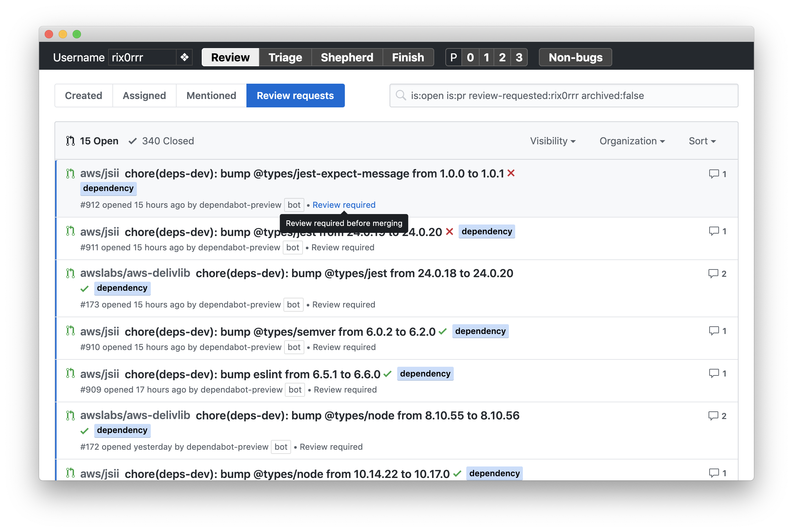

CDK GitHub queries
===================

A trivial Chrome app to keep track of common GitHub issue queries.

## Installation

In Chrome, go to [chrome://extensions/](chrome://extensions/), enable **Developer Mode** and click **Load unpacked**.

After that, it will appear on your **Apps** tab.

## Usage

Fill out your GitHub username. Some queries depend on you being logged in, so be sure to log in once (logins should be
saved for future sessions).
